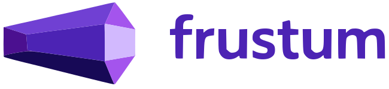

# Frustum — The 3D Prompt Gallery

A community gallery for AI-generated 3D model prompts. Share the exact prompt you used, show the render, let the community vote on what actually works.

Built as a Round 2 submission for the DekNek3D Full Stack Developer Internship.

---

## What it does

- Browse prompts that generated real 3D renders, sorted by trending, new, or top all time
- Filter by AI tool (DekNek3D, Meshy, Tripo, Spline) and category
- Submit your own prompt + render image
- Upvote prompts you found useful — toggle on/off, no double votes
- User profiles with total prompt count and upvote stats
- Google OAuth and email/password sign in
- Update your profile photo and bio from settings

---

## Tech stack

- **Next.js 16** — App Router, server + client components, async params
- **NextAuth v5** — Google OAuth + Credentials provider, JWT sessions
- **MongoDB + Mongoose** — Atlas cluster, global connection cache
- **shadcn/ui + Tailwind CSS v4** — dark violet theme
- **Vercel** — deployment

---

## Running locally

1. Clone the repo
2. Install dependencies
   ```bash
   npm install
   ```
3. Create `.env.local` in the root:
   ```
   MONGODB_URI=your_atlas_connection_string
   NEXTAUTH_SECRET=your_random_secret
   GOOGLE_CLIENT_ID=your_google_client_id
   GOOGLE_CLIENT_SECRET=your_google_client_secret
   NEXTAUTH_URL=http://localhost:3000
   ```
4. Run the dev server
   ```bash
   npm run dev
   ```
5. Open [http://localhost:3000](http://localhost:3000)

